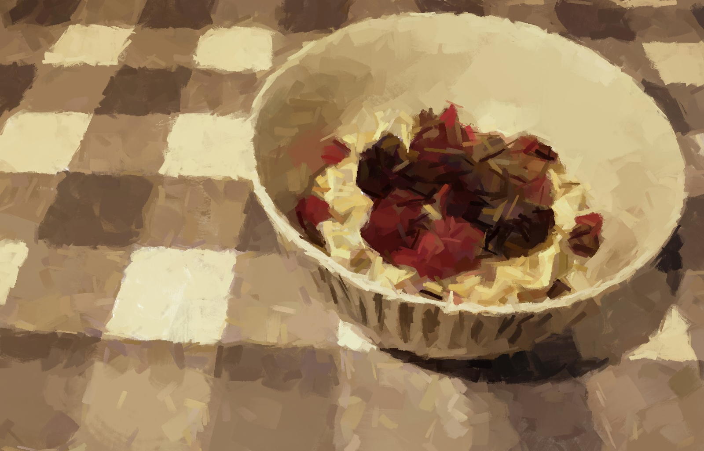

# Granola

Makes 7 portions.

## Ingredients
- 400g rolled oats
- 100g hazelnuts
- 100 pumpkin seeds
- 100 dried mulberries
- 1 tbsp cinnamon

### To Serve
- 1 handful of fresh berries
- 1 tsp chia seeds
- 200ml milk of choice

## Method
1. Preheat oven to 180°C. In two batches, combine the oats, nuts, seeds and cinnamon in a food processor for 5-10 seconds (longer if you want a finer texture).
2. Pour into two large shallow baking trays and roast for 10 mins.
3. Remove to cool, sprinkling over the dried berries and some salt.
4. Serving suggestion: 100g granola (about 2 ladlefuls) with berries, chia seeds and milk.