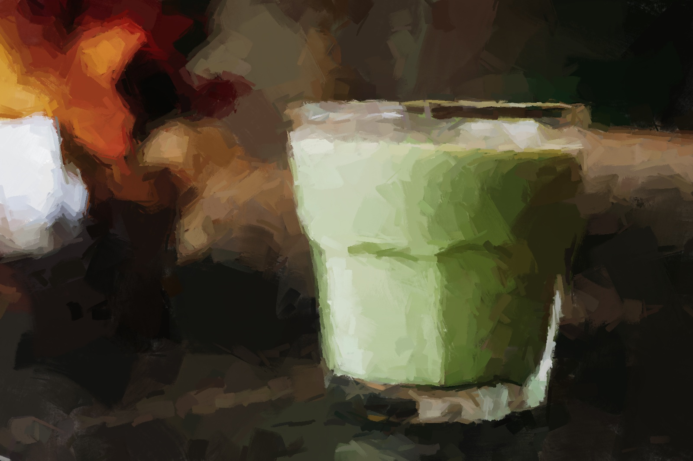

# Green Smoothie

Makes 1 smoothie.

## Ingredients
- 1 handful of leafy greens
- 1 apple, cored
- 1 banana, sliced
- 1 tbsp peanut butter
- 1 tsp chia seeds
- 2 ice cubes
- 200ml milk

## Method
1. Chuck everything into a blender and pulse until chewing is no longer required.